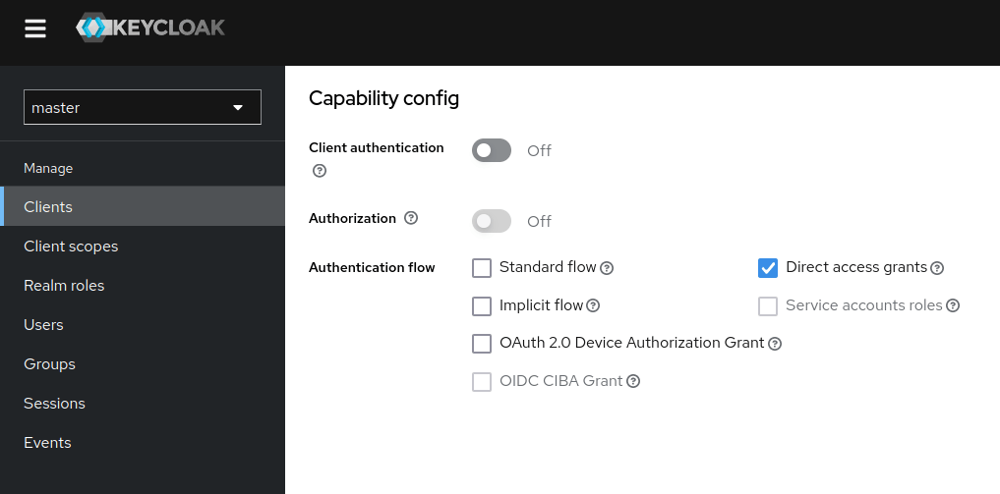

# Keycloak Shell Scripts

# Keycloak Client Config

In order to be able to retrieve tokens via curl the client's configuration in Keycloak needs to be set up accordingly. Make sure `Client authentication` is off and enable `Direct access grants` as seen below.



# Create configuration toml

Create a configuration toml inside the `configs` folder. Use `examples/conf.toml` as template. Fill it with your Keycloak's url and the required authentication data

# Run scripts

The scripts are located inside the `sh` folder. If you have multiple configuration files inside `configs` you can use a positional argument to make use of the correct toml file. The first file that contains the given substring is used.

```shell
# display help
sh/get_user_access_token --help

# retrieve user access token
sh/get_user_access_token myconf

# retrieve and decode client access token, verbose mode
sh/get_client_access_token anotherconf -v -d
```
